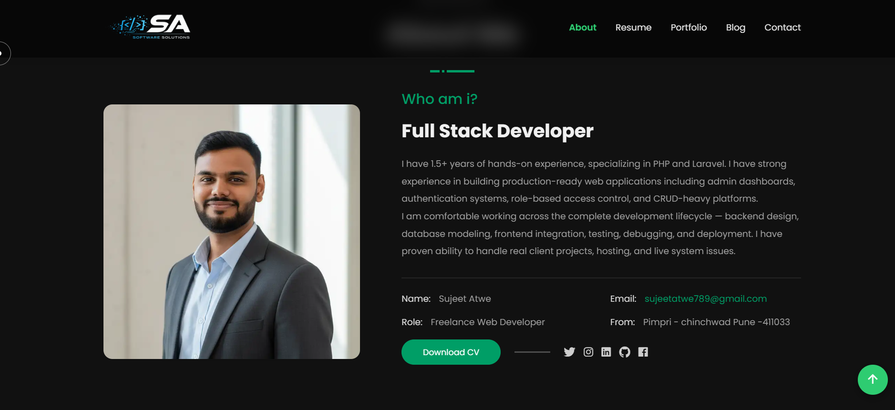

<div align="center">

# 🌐 Dynamic Portfolio Platform

### 🚀 Modern Full-Stack Developer Portfolio & Content Management Platform

*A dynamic portfolio platform built for developers, freelancers, and professionals to showcase projects, blogs, resumes, skills, and achievements through a modern admin-controlled system.*

<br>


<br>


<br>

[](https://sujeetatwe.com)

</div>

---

# 🚀 Project Overview

This platform is designed for developers, freelancers, designers, and professionals to manage and showcase their portfolios through a centralized admin-controlled content management system.

The application enables dynamic management of:

- 👨‍💻 Projects
- 📝 Blogs
- 📄 Resume Data
- 💼 Skills & Experience
- 📬 Contact Information
- 🌐 Portfolio Content

All content is dynamically controlled through an admin dashboard without modifying source code.

---

# ✨ Core Features

### 🌐 Public Portfolio Website
- Dynamic Portfolio Showcase
- Project Display Pages
- Responsive Modern UI
- Personal Branding Interface
- Skills & Experience Sections

### 🧑‍💼 Admin Dashboard
- Project Management
- Blog Upload System
- Resume Management
- Content Management
- Dashboard Analytics

### 📝 Blog Publishing System
- Dynamic Blog Management
- Article Publishing Workflow
- Blog Dashboard Control
- Content Editing System

### 📄 Resume & Profile Management
- Resume Upload Workflow
- Dynamic Profile Editing
- Experience Management
- Skill Showcase System

### 🎨 UI/UX Features
- Dark-Themed Modern Design
- Responsive Layout
- Interactive Animations
- Smooth Navigation Experience

---

# 🖼️ Project Screenshots

## 🏠 Home Page

<p align="center">
  
</p>

---

## 👤 Profile Section

<p align="center">
  
</p>

---

## 💼 Project Showcase Page

<p align="center">
  
</p>

---

# 🧑‍💼 Admin Dashboard

## 📊 Dashboard Overview

<p align="center">
  
</p>

---

## 📁 Project Management Dashboard

<p align="center">
  
</p>

---

## 📝 Blog Upload Dashboard

<p align="center">
  
</p>

---

## 📄 Resume Upload Dashboard

<p align="center">
  
</p>

---

# 🧩 System Modules

| Module | Description |
|---|---|
| 🌐 Portfolio Website | Public-facing developer portfolio |
| 🧑‍💼 Admin Dashboard | Centralized content management |
| 💼 Project Showcase | Dynamic project publishing |
| 📝 Blog System | Blog article management workflow |
| 📄 Resume Management | Resume & experience handling |
| 📬 Contact System | User interaction & communication |

---

# 🛠️ Technology Stack

## ⚙️ Backend
- Laravel 11
- PHP 8.2+
- REST APIs

## 🎨 Frontend
- Blade Templates
- Tailwind CSS
- JavaScript
- Vite

## 🗄️ Database
- MySQL

## 🔐 Authentication
- Laravel Authentication

---

# 👨‍💻 My Contributions

- Full-Stack Development
- Portfolio CMS Architecture
- Admin Dashboard Development
- Blog Management System
- Resume Management Workflow
- UI/UX Design Implementation
- Database Design
- Dynamic Content System
- Responsive Frontend Development

---

# 📈 Platform Highlights

```text
🌐 Dynamic Portfolio Management
🧑‍💼 Admin-Controlled CMS
📄 Resume & Blog Management
⚡ Responsive Modern UI
🎨 Dark-Themed User Experience
🚀 Scalable Full-Stack Architecture
```

---

# 🔒 Confidentiality Notice

This repository is a public showcase version created for portfolio and demonstration purposes.

Source code, deployment infrastructure, and business logic are maintained privately for security and project management requirements.

---

# 👨‍💻 Author

<div align="center">

## Sujeet Atwe

### 🚀 Full Stack & AI Developer

[](https://github.com/Sujeetatwe)

[](https://sujeetatwe.com)

</div>

---

<div align="center">

### ⭐ If you like this project showcase, give it a star on GitHub ⭐

</div>
